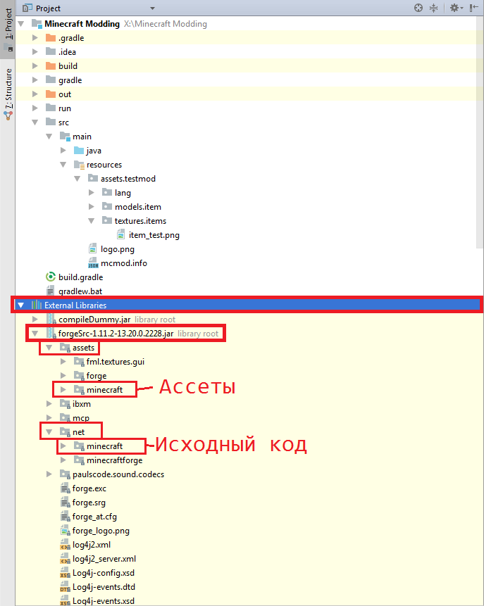

# Исходники Minecraft

Мы разрабатываем моды для Minecraft, а значит находимся в очень тесной связи и с ним.

Иногда возникают вопросы вида:
* Как сделать портал?
* Как отловить правый клик по блоку?
* Как добавить описание под названием предмета?

Ответы на подобного вида вопросы **ВСЕГДА** нужно искать в исходном коде Minecraft. 99% того, что вы хотите создать в своем
моде уже было реализовано в Minecraft. Можно просто посмотреть, как (правильно) сделано в игре, и, на основе готового
примера, сделать что-то свое.

Для этого нам нужно уметь обращаться к исходным кодам и ассетам (звукам, текстурам, моделям) Minecraft.

## Idea

В Intellij Idea исходники можно найти, открыв в проводнике слева вкладку External Libraries и найдя файл "forgeSrc-*версия Minecraft*-*версия Forge*.jar".

Например, в моем случае .jar файл называется так: `forgeSrc-1.11.2-13.20.0.2228.jar`.

Откройте его и увидите достаточно много папок:



## Eclipse

В Eclipse действия аналогичные. Вам необходимо открыть в проводнике слева вкладку "Project and External Dependencies", а в ней
найти .jar файл "forgeSrc-*версия Minecraft*-*версия Forge*.jar", например  `forgeSrc-1.11.2-13.20.0.2228.jar`.

## Пояснение

В пакете `assets/minecraft` находятся все ресурсы Minecraft: текстуры, JSON описания моделей, файлы локализации и так далее.

Кстати, именно потому что в Minecraft все ресурсы располагаются по пути `assets/minecraft`, мы и при разработке модов
в папке resources создаем папку `assets/*modid*`. Так как модели самого Minecraft располагаются в папке `models`, то и
мы в наших модах создаем папку `models` и так далее.

В пакете `net.minecraft` находится исходный код игры. Файлов там очень много и именно там находятся ответы на 90%
всех ваших вопросов.

## Пример

**Как сделать, чтобы блок взрывался при клике правой кнопкой на нем?** Мы знаем, что сундук можно открыть правой кнопкой
мыши. Находим в пакете `net.minecraft.block` файл `BlockChest.java`.

Там есть следующий кусок кода:

```java
/**
 * Called when the block is right clicked by a player.
 */
public boolean onBlockActivated(World worldIn, BlockPos pos, IBlockState state, EntityPlayer playerIn, EnumHand hand, EnumFacing facing, float hitX, float hitY, float hitZ)
{
    ...
}
```

Вот мы и нашли метод, который надо записать в файле нашего блока. Он будет выполняться, когда по нашему блоку кликнут.

Теперь про взрывы. Отличный пример — TNT. Все в том же пакете ищем файл `BlockTNT.java`. Там мы можем найти интересный метод
`explose(...)`. Внутри него видим, что при активации TNT он превращается некую сущность `entity` под названием `EntityTNTPrimed`.

Ищем этот файл в пакете `net.minecraft.entity`. Он будет находиться в пакете `net.minecraft.entity.item`.

Внутри него видим следующий метод:

```java
private void explode()
{
    float f = 4.0F;
    this.world.createExplosion(this, this.posX, this.posY + (double)(this.height / 16.0F), this.posZ, 4.0F, true);
}
```

Строчка `this.world.createExplosion(this, this.posX, this.posY + (double)(this.height / 16.0F), this.posZ, 4.0F, true);` как раз
то, что нам нужно!

В нашем блоке `BlockTest.java` осталось записать:

```java
public boolean onBlockActivated(World worldIn, BlockPos pos, IBlockState state, EntityPlayer playerIn, EnumHand hand, EnumFacing facing, float hitX, float hitY, float hitZ)
{
    if (!worldIn.isRemote)
    {
        this.world.createExplosion(this, pos.getX(), pos.getY(), pos.getZ(), 4.0F, true);
    }

    return true;
}
```

## Итог

Почти наверняка то, что вы хотите добавить в своем моде уже реализовано в игре в том или ином смысле.
Старайтесь найти примеры в исходном коде и используйте их для реализации своих идей.

К тому же, ориентируясь на исходники игры, вы будете лучше понимать их внутреннюю структуру, что сильно облегчает создание модов.
