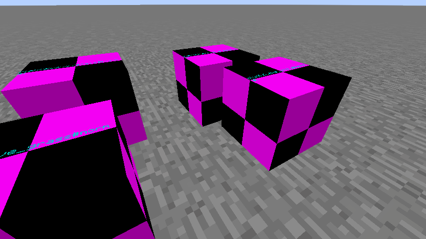
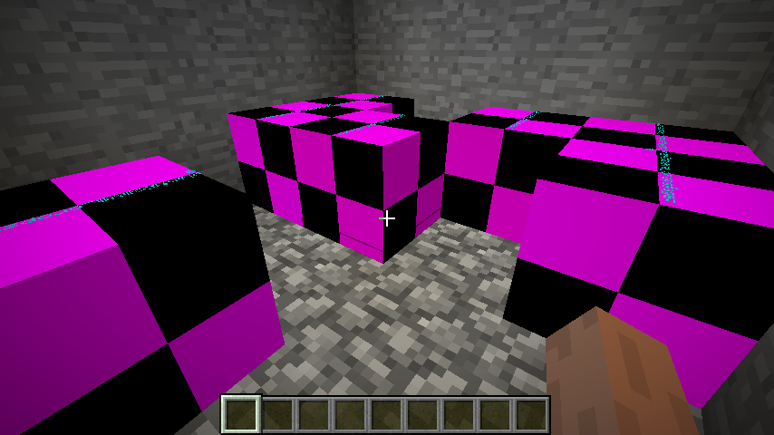
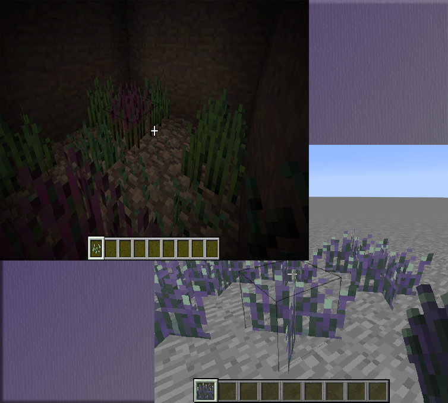

# [Мод] Пещерные растения

_Автор статьи — [Крокодил](https://forum.mcmodding.ru/members/%D0%9A%D1%80%D0%BE%D0%BA%D0%BE%D0%B4%D0%B8%D0%BB.4289/)._

_Рабочий тестовый мод с материалами данной статьи можно скачать [здесь](images/src.zip)._

Доброго времени суток, и если вкратце, то: 
* Я сделаю пещерную траву, растущую на камнях.
* Семена, из этой травы выпадающие.
* Сель-хоз культуру, которую можно вырастить из семян. Она растёт на булыжнике, при низком уровне освещения, и может умереть при высоком.
* Я подробно опишу регистрацию, этих предметов и блоков, их локализацию, создание моделей и т. д.

Прежде всего, создадим основу мода. Его id будет "plants". Если вы не знаете как это сделать, загляните [сюда](http://mcmodding.ru/book/1.12+/forge/base/mod_structure/). После этого можно идти дальше.

Начать можно с чего угодно, но мы начнём с блоков.

## Пещерная трава
В пакете, нашего мода, создадим пакет под названием `blocks`, в моём случае его полное имя выглядит так: `ru.mousecray.plants.blocks`. Создадим в этом пакете класс нашей пещерной травы и назовём его `CaveGrass.java`:
```java
package ru.mousecray.plants.blocks;

import net.minecraftforge.common.IShearable;
import net.minecraft.block.BlockBush;

public class CaveGrass extends BlockBush implements IShearable {
    //Тело класса
}
```

Мы наследуем от класса `BlockBush` и тем самым передаём, большую часть свойств обычной травы из майнкрафта. `IShearable` - интерфейс от форджа, который позволит добывать нашу траву ножницами.

Теперь добавим в тело класса конструктор:
```java
    public CaveGrass() {
        super(Material.VINE);
        setSoundType(SoundType.PLANT);
        setUnlocalizedName("cave_grass");
        setRegistryName("cave_grass");
        setLightLevel(0.3F);
    }
```

`Material.VINE` - установка материала, для нашей травы, `setSoundType` - установка звука, `setUnlocalizedName` и `setRegistryName` - установка отображаемого имя и имя для регистрации, `setLightLevel` - свечение нашей травы(Ну трава ведь пещерная).

И кстати, не забудьте добавить в начало класса эту строчку:
```java
protected static final AxisAlignedBB CAVE_GRASS_AABB = new AxisAlignedBB(0.09999999403953552D, 0.0D, 0.09999999403953552D, 0.8999999761581421D, 0.800000011920929D, 0.8999999761581421D);
```

Она нам пригодится, когда мы будем делать `BoundingBox` - рамку выделения. Коллизии у травы не будет, но за нас это уже решил `BlockBush`.

Дальше следуют методы, которые придадут нашей траве некоторые необходимые свойства:
```java
    @Override
    //Этот метод определяет BoundingBox блока
    public AxisAlignedBB getBoundingBox(IBlockState state, IBlockAccess source, BlockPos pos) {
       //Вот и пригодилась строчка
       return CAVE_GRASS_AABB;
    }

    @Override
    //Этот метод позволит, ставить блоки в траву, и тем самым заменять её
    public boolean isReplaceable(IBlockAccess world, BlockPos pos) {
        return true;
    }

    @Override
    //В обычной ситуации из блока ничего не будет выпадать и лишь иногда семена
    public Item getItemDropped(IBlockState state, Random rand, int fortune) {
        return null;
    }

    @Override
    //Семена будут выпадать в случайном кол-ве
    public int quantityDroppedWithBonus(int fortune, Random random) {
        return 1 + random.nextInt(fortune * 2 + 1);
    }

    @Override
    //Смещение блока. Возможны, вы замечали, что цветы и трава не всегда стоят по центру блока
    public Block.EnumOffsetType getOffsetType() {
        return Block.EnumOffsetType.XYZ;
    }

    @Override
    //Этот метод служит исключительно для статистики
    public void harvestBlock(World world, EntityPlayer player, BlockPos pos, IBlockState state, @Nullable TileEntity te, ItemStack stack) {
        if (!world.isRemote && stack.getItem() == Items.SHEARS) {
            player.addStat(StatList.getBlockStats(this));
        }
        else {
            super.harvestBlock(world, player, pos, state, te, stack);
        }
    }
    @Override
    //Указывает, на какой блок можно поставить траву. В нашем случае камень
    public boolean canPlaceBlockAt(World world, BlockPos pos) {
        return world.getBlockState(pos).getBlock().isReplaceable(world, pos) && world.getBlockState(pos.down()).getBlock() == Blocks.STONE;
    }

    @Override
    //Метод, аналогичный предыдущему, но как видно из названия, служит для
    //проверок в стиле: "может ли блок стоять здесь". Например, используется в генерации
    public boolean canBlockStay(World world, BlockPos pos, IBlockState state) {
        return world.getBlockState(pos.down()).getBlock() == Blocks.STONE;
    }

    @Override
    //Наш блок можно добыть ножницами
    public boolean isShearable(ItemStack item, IBlockAccess world, BlockPos pos) {
        return true;
    }

    @Override
    //Что происходит, когда наш блок добывают ножницами
    public NonNullList onSheared(ItemStack item, IBlockAccess world, BlockPos pos, int fortune) {
        return NonNullList.withSize(1, new ItemStack(ListBlocks.CAVE_GRASS));
    }

    @Override
    //Отвечает за дроп семян из травы. В темноте будут выпадать пещерные семена, на свету - семена пшеницы.
    //Метод будет выдавать ошибку, так как предмета CAVE_SEEDS ещё не существует
    public void getDrops(NonNullList<ItemStack> drops, IBlockAccess world, BlockPos pos, IBlockState state, int fortune) {
        ItemStack seed = ItemStack.EMPTY;

        if (RANDOM.nextInt(30) != 0) {
            return;
        }

        if(world instanceof World) {
            //Проверяем, что наш блок не "видит" неба
            if(!((World) world).canSeeSky(pos)) {
                 seed = new ItemStack(ListItems.CAVE_SEEDS, fortune);
            }
            else {
                seed = new ItemStack(Items.WHEAT_SEEDS, fortune);
            }
        }

        //Добавляем дроп
        if (!seed.isEmpty()) {
            drops.add(seed);
        }
    }
```

Траву мы закончили, и теперь создадим новый класс в пакете `blocks` - `ListBlocks.java`.
В нём мы будем регистрировать все наши блоки.
`ListBlocks.java`:
```java
public class ListBlocks {

    //Создаём экземпляр нашего блока
    public static Block CAVE_GRASS = new CaveGrass();

    public static void onRegister() {
        //Здесь мы будем регистрировать ВСЕ блоки
        register(CAVE_GRASS);
    }

    @SideOnly(Side.CLIENT)
    public static void onRender() {
        //Здесь мы будем регистрировать ВСЕ рендеры блоков
        registerRender(CAVE_GRASS);
    }

    private static void register(Block block) {
        //Регистрируем блок на земле
        ForgeRegistries.BLOCKS.register(block);
        //Регистрируем блок как предмет в инвентаре
        ForgeRegistries.ITEMS.register(new ItemBlock(block).setRegistryName(block.getRegistryName()));
    }

    @SideOnly(Side.CLIENT)
    private static void registerRender(Block block) {
        //Регистрируем рендер предмета в инвентаре
        Minecraft.getMinecraft().getRenderItem().getItemModelMesher().register(Item.getItemFromBlock(block), 0, new ModelResourceLocation(block.getRegistryName(), "inventory"));
    }
}
```

В результате запуска игры видим вот этот ужас:



Но мы видим, что во-первых, наша трава стоит на камне, во-вторых она стоит не по центру блока, а немного смещена. Четверть работы сделана, идём дальше.

## Пещерные ростки
Теперь в том же пакете `blocks`, создадим технический блок `CaveCrops.java`.
Это будут наши ростки.
`CaveCrops.java`:
```java
public class CaveCrops extends BlockCrops {
    //Наследуем от базовых  ростков, и передаём большинство свойств. Будьте с этим осторожны,
    //некоторые непереопределённые методы из суперклассов, могут работать неправильно.

    //Создаём набор BoundingBox'ов, для разных стадий роста растения.
    private static final AxisAlignedBB[] CAVE_CROPS_AABB = new AxisAlignedBB[] {new AxisAlignedBB(0.0D, 0.0D, 0.0D, 1.0D, 0.125D, 1.0D), new AxisAlignedBB(0.0D, 0.0D, 0.0D, 1.0D, 0.1875D, 1.0D), new AxisAlignedBB(0.0D, 0.0D, 0.0D, 1.0D, 0.25D, 1.0D), new AxisAlignedBB(0.0D, 0.0D, 0.0D, 1.0D, 0.3125D, 1.0D), new AxisAlignedBB(0.0D, 0.0D, 0.0D, 1.0D, 0.375D, 1.0D), new AxisAlignedBB(0.0D, 0.0D, 0.0D, 1.0D, 0.4375D, 1.0D), new AxisAlignedBB(0.0D, 0.0D, 0.0D, 1.0D, 0.5D, 1.0D), new AxisAlignedBB(0.0D, 0.0D, 0.0D, 1.0D, 0.5625D, 1.0D)};

    public CaveCrops() {
        setUnlocalizedName("cave_crops");
        setRegistryName("cave_crops");
        setLightLevel(0.3F);
        //Здесь параметров поменьше, так как BlockCrops, часть их уже установил
    }

    @Override
    //Можно поставить только на булыжник
    public boolean canPlaceBlockAt(World world, BlockPos pos) {
        return world.getBlockState(pos).getBlock().isReplaceable(world, pos) && world.getBlockState(pos.down()).getBlock() == Blocks.COBBLESTONE;
    }

    @Override
    //Метод, аналогичный предыдущему, но как видно из названия, служит для
    //проверок в стиле: "может ли блок стоять здесь". Например, используется в генерации
    public boolean canBlockStay(World world, BlockPos pos, IBlockState state) {
        return world.getBlockState(pos.down()).getBlock() == Blocks.COBBLESTONE;
    }

    @Override
    //Возвращает семена. Выдаст ошибку т. к. семян ещё не существует
    protected Item getSeed() {
        return ListItems.CAVE_SEEDS;
    }

    @Override
    //Возвращает урожай, уголь
    protected Item getCrop() {
        return Items.COAL;
    }

    @Override
    //Возвращает BoundigBox, в зависимости от роста
    public AxisAlignedBB getBoundingBox(IBlockState state, IBlockAccess source, BlockPos pos) {
        return CAVE_CROPS_AABB[((Integer)state.getValue(getAgeProperty())).intValue()];
    }

    @Override
    /*
     * Здесь мы просчитываем дополнительный дроп, помимо угля.
     * Лазурит, золотой самородок, железный самородок - 30%
     * Алмаз 10%
     */
    public void getDrops(NonNullList<ItemStack> drops, IBlockAccess world, BlockPos pos, IBlockState state, int fortune) {
        super.getDrops(drops, world, pos, state, fortune);
        //Проверяем, что урожай, при разрушении, был созревшим
        if(this.isMaxAge(state)) {
            int random = RANDOM.nextInt(100)+1;

            if (random < 30) {
                drops.add(new ItemStack(Items.DYE, 1, 4));
            }
            else if(random < 60) {
                drops.add(new ItemStack(Items.GOLD_NUGGET));
            }
            if(random < 90) {
                drops.add(new ItemStack(Items.IRON_NUGGET));
            }
            else {
                drops.add(new ItemStack(Items.DIAMOND));
            }
        }
    }
}
```

Отдельно хочу остановится на методе `updateTick`, который задаст нашему растению самые главные свойства. Этот метод мы переопределим в конец класса `CaveCrops.java`.
```java
    @Override
    //Этот метод вызывается случайным образом, в нём мы пропишем рост
    //наших ростков. Я решил пойти обратным путём, поэтому наше растение,
    //на солнце и при свете, может умереть, а расти будет только в пещерах.
    public void updateTick(World world, BlockPos pos, IBlockState state, Random rand) {
        //Проверяем, что растение стоит на нужном блоке (на камне)
        //Это метод из суперкласса, но он использует метод canBlockStay,
        //который мы переопределили раньше
        this.checkAndDropBlock(world, pos, state);
        
        //Получаем "возраст" растения
        int i = this.getAge(state);       
        //Получаем шанс роста.
        float f = getGrowthChance(this, world, pos);
        
        if(world.getLightFromNeighbors(pos.up()) <= 5) {
            //Проверяем, что возраст растения меньше максимального
            if (i < this.getMaxAge()) {
            //Необходимо для событий форджа. Не стоит его игнорировать.
                if(ForgeHooks.onCropsGrowPre(world, pos, state, rand.nextInt((int)(25.0F / f) + 1) == 0)) {
                    //Устанавливаем наш блок ростков, увеличивая возраст на 1
                    world.setBlockState(pos, this.withAge(i + 1), 2);
                    //Вызываем событие форджа. Если мы хотим чтобы другие моды,
                    //через фордж смогли узнать о том, что наше растение подросло,
                    //нам нужно выполнить этот метод
                    ForgeHooks.onCropsGrowPost(world, pos, state, world.getBlockState(pos));
                }
            }
        }
        //Если если уровень освещения больше 5, то
        //проверяем, что возраст растения не равен 0, то есть минимальному
        else if(i != 0) {
            //Устанавливаем наш блок ростков, уменьшая возраст на 1,
            //то-есть наше растение слабеет
            world.setBlockState(pos, this.withAge(i - 1), 2);
            //Вызываем событие форджа.
            ForgeHooks.onCropsGrowPost(world, pos, state, world.getBlockState(pos));
        }
        //Если возраст всё же равен минимальному, и слабеть больше некуда, то
        else {
            //Устанавливаем блок воздуха, то-есть наше растение исчезает (умирает)
            world.setBlockToAir(pos);
            //Вызываем событие форджа.
            ForgeHooks.onCropsGrowPost(world, pos, state, world.getBlockState(pos));
        }
    }
```

*А если человеческими словами объяснить, что мы сделали, вот что получится:
Пещерные ростки, растут только при очень низком уровне освещения. Если уровень освещения (от солнца, от факелов) высокий, то наша сель-хоз культура будет слабеть, уменьшаться, и в конце-концов вообще умрёт (исчезнет).*

Зарегистрируем наши ростки, аналогично траве, но `registerRender(CAVE_CROPS);` то есть рендер блока, добавлять не будем т. к. блок технический, и в инвентаре появляться не должен.

Запустим игру и посмотрим, что вышло...



Мда... выглядит не очень красиво, но! Это действительно наши ростки, ибо они стоят на булыжнике, и в направлении курсора мы видим рамку выделения. 50% мода сделано, мы приближаемся к логическому завершению, ещё чуть-чуть и...

## Пещерные семена
Из физического контента мода, нам осталось сделать только семена. В "главном" пакете(в моём случае это `ru.mousecray.plants`) создадим пакет `items`, а в нём класс `CaveSeeds.java`. Вы возможно спросите: почему бы не создать экземпляр класса `ItemSeeds`? Всё просто: ванильные семена нельзя будет поставить на любой блок.
`CaveSeeds.java`:
```java
public class CaveSeeds extends Item implements IPlantable {

    public CaveSeeds() {
        setUnlocalizedName("cave_seeds");
        setRegistryName("cave_seeds");
        //Вкладка в креативе
        setCreativeTab(CreativeTabs.MATERIALS);
    }

    @Override
    //Что происходит, когда мы пытаемся посадить растение
    public EnumActionResult onItemUse(EntityPlayer player, World world, BlockPos pos, EnumHand hand, EnumFacing facing, float hitX, float hitY, float hitZ) {
        ItemStack itemstack = player.getHeldItem(hand);
        IBlockState state = world.getBlockState(pos);
        if (facing == EnumFacing.UP && player.canPlayerEdit(pos.offset(facing), facing, itemstack) && state.getBlock() == Blocks.COBBLESTONE && world.isAirBlock(pos.up())) {
            world.setBlockState(pos.up(), ListBlocks.CAVE_CROPS.getDefaultState());

            if (player instanceof EntityPlayerMP) {
                CriteriaTriggers.PLACED_BLOCK.trigger((EntityPlayerMP)player, pos.up(), itemstack);
            }

            itemstack.shrink(1);
            return EnumActionResult.SUCCESS;
        }
        else {
            return EnumActionResult.FAIL;
        }
    }

    @Override
    //Возвращает тип растения. Типы можно посмотреть в классе EnumTypePlant
    public EnumPlantType getPlantType(IBlockAccess world, BlockPos pos) {
        return EnumPlantType.Crop;
    }

    @Override
    //Возвращает блок растения
    public IBlockState getPlant(IBlockAccess world, BlockPos pos) {
        return ListBlocks.CAVE_CROPS.getDefaultState();
    }
```

Теперь создадим в пакете items класс `ListItems.java`.
Он сделан также как `ListBlocks`:
`ListItems.java`:
```java
public class ListItems {

    public static Item CAVE_SEEDS = new CaveSeeds();

    public static void onRegister() {
        register(CAVE_SEEDS);
    }

    @SideOnly(Side.CLIENT)
    public static void onRender() {
        registerRender(CAVE_SEEDS);
    }

    private static void register(Item item) {
        //Регистриируем предмет
        ForgeRegistries.ITEMS.register(item);
    }

    @SideOnly(Side.CLIENT)
    private static void registerRender(Item item) {
        //Регистрируем рендер предмета
        Minecraft.getMinecraft().getRenderItem().getItemModelMesher().register(item, 0, new ModelResourceLocation(item.getRegistryName(), "inventory"));
    }
}
```

Почти всё! Осталось только внести в класс `CommonProxy.java` в метод `preInit` эти строчки:
```java
ListBlocks.onRegister();
ListItems.onRegister();
```

А в `ClientProxy.java` в метод `init`:
```java
ListBlocks.onRender();
ListItems.onRender();
```

Ну вот, теперь всё. Почти.

## Визуальная часть
Прежде чем мы начнём, вы должны взглянуть на `src/main/resources` и убедится что всё соответствует схеме:


Люди, знакомые с создание моделей на 1.12 уже заметили, что пакета `models.block` у нас нету. Это потому, что благодаря формату моделей от форджа, и варианты и сами модели объединены в одном файле для каждого блока. Этот файл находится в пакете `blockstates`.

Теперь, в пакете `blockstates` создадим файлы `cave_grass.json`, `cave_crops.json` (пещерная трава и пещерные ростки).

Будем использовать формат моделей форжа, с ним придётся создавать меньше файлов:

`cave_grass.json`:
```json
{
    "forge_marker": 1,
    "defaults": {
        "textures": {
            "cross": "plants:blocks/cave_grass"
        }
    },
    "variants": {
        "normal": {
            "model": "tinted_cross"
        }
    }
}
```

`cave_crops.json`:
```json
{
    "forge_marker": 1,
    "defaults": {
        "model": "crop"
    },
    "variants": {
        "age": {
            "0": {
                "textures": {
                    "crop": "plants:blocks/cave_crops0"
                }
            },
            "1": {
                "textures": {
                    "crop": "plants:blocks/cave_crops1"
                }
            },
            "2": {
                "textures": {
                    "crop": "plants:blocks/cave_crops2"
                }
            },
            "3": {
                "textures": {
                    "crop": "plants:blocks/cave_crops3"
                }
            },
            "4": {
                "textures": {
                    "crop": "plants:blocks/cave_crops4"
                }
            },
            "5": {
                "textures": {
                    "crop": "plants:blocks/cave_crops5"
                }
            },
            "6": {
                "textures": {
                    "crop": "plants:blocks/cave_crops6"
                }
            },
            "7": {
                "textures": {
                    "crop": "plants:blocks/cave_crops7"
                }
            }
        }
    }
}
```

В пакете `models.item` создадим файлы `cave_seeds.json` и `cave_grass.json` (семена и трава). Если вспомнить, то мы не регистрировали модель предмета для ростков, потому её мы делать не будем.

`cave_seeds.json`:
```json
{
    "parent": "item/generated",
    "textures": {
        "layer0": "plants:items/cave_seeds"
    }
}
```

`cave_grass.json`:
```json
{
    "parent": "item/generated",
    "textures": {
        "layer0": "plants:blocks/cave_grass"
    }
}
```

Возьмём находящиеся ниже текстуры и переместим в пакет `textures.blocks`. Это будут текстуры наших блоков (трава и ростки).


Возьмём эту текстуру и переместим в пакет `textures.items`. Это будут текстуры наших предметов (семена).


В пакете `lang` создадим два файла: `en_us.lang` и `ru_ru.lang`.
Важно: файл `ru_ru.lang` должен иметь кодировку UTF8 без BOM.

`en_us.lang`:
```
tile.cave_grass.name=Cave grass
tile.cave_crops.name=Cave crops

item.cave_seeds.name=Cave seeds
```

`ru_ru.lang`:
```
tile.cave_grass.name=Пещерная трава
tile.cave_crops.name=Пещерные ростки

item.cave_seeds.name=Пещерные семена
```

## Итоги
Давайте запустим игру и посмотрим, что у нас получилось (Для того, чтобы вы хоть что-то увидели в кромешной темноте, я увеличил ярокость изображения):



*Для проверки, вы можете посадить растения и ввести команду "/gamerule randomTickSpeed 3000" (изменяет частоту updateTick. В нашем случае, скорость роста растений увеличится), и посмотреть, что выйдет. Растения будут расти только в темноте.*

Итак, вот список того, что у нас получилось:
* Пещерная трава, растущая на камне, и излучающая свет. В пещерах, с неё падают пещерные семена, а под небом - семена пшеницы.
* Пещерные семена, можно посадить на булыжник, и вырастут пещерные ростки.
* Пещерные ростки, растут на булыжнике, но только при уровне освещения ниже среднего. От света они слабеют и умирают. Излучают слабый свет. Дроп: пещерные семена, уголь и с некоторым шансом драгоценности.

Я пытался по возможности всё расписать, но если что-то непонятно или что-то не получилось - вы можете скачать архив с исходниками, а также написать мне комментариях, и я попробую всё исправить.