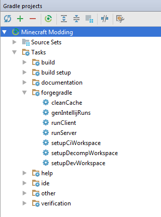

# Использование Idea

Итак, у нас есть папка со следующими файлами внутри:

* build.gradle
* gradlew (.bat и .sh)
* папка gradle

Запустите Idea и в стартовом окне кликните по кнопке "Import Project". Импортируйте файл "build.gradle".

Убедитесь, что у вас выбран пункт "Use default gradle wrapper (recommended)". Все остальные настройки оставьте
по умолчанию и нажмите ОК.

Потребуется подождать около минуты, пока среда разработки полностью выполнит все импортирует.
За процессом импорта можно следить в правом нижнем углу среды разработки.

Теперь откройте меню "View" в верхней части экрана и выберите пункты "Tools Windows > Gradle".

У вас откроется окно с Gradle задачами. Gradle — популярная система автоматической сборки, которая из исходников
собирает готовые программы и делает еще много других необходимых, но **рутинных** дел. Эти самые дела называются
задачами/заданиями/тасками — **tasks**. Мы как раз и открыли окно тасков.

Выглядит оно примерно так:

Выполните таск `setupDecompWorkspace` из группы `forgegradle`. После его завершения выполните таск `genIntellijRuns` из
той же группы.

Этими двумя командами мы автоматически и без лишних хлопот настроили рабочее пространство. Чувствуете мощь автоматических
сборщиков?

### Для Idea 2016 или старше

Откройте меню "Run" в верхней части экрана и выберите пункт "Edit configurations...".

В левой части появившегося окна откройте вкладку "Application". По очереди выберите "Minecraft Client" и в "Minecraft Server"
и уже в правой части окна, в раскрывающемся списке "Use classpath of module" выберите тот пункт, который заканчивается на _main.

### Тестовый запуск

Вы только что настроили рабочее пространство для создания собственного мода. Если хотите, можете запустить
клиент или сервер и удостовериться, что все работает, как надо.

Для запуска опять откройте меню "Run" и выберите пункт "Run...". Появится окно с выбором, что запустить.
